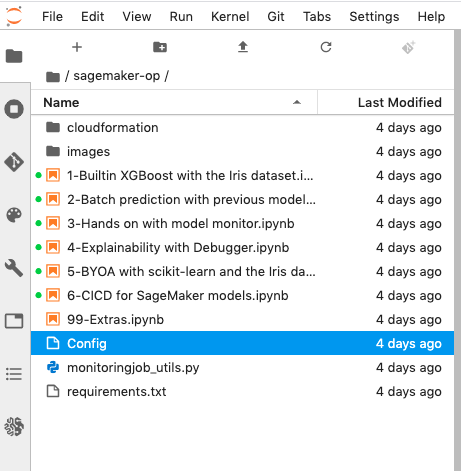
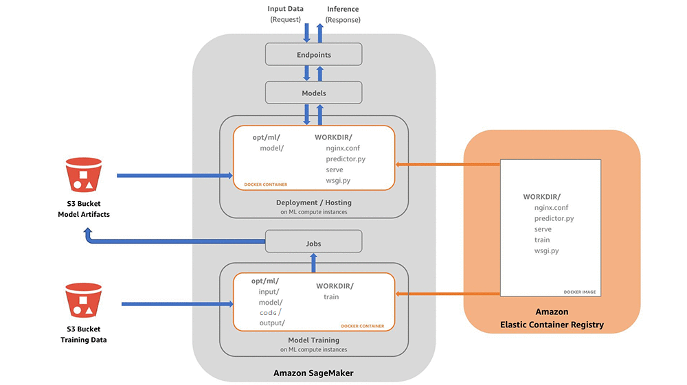

# SageMaker lab
- [SageMaker lab](#sagemaker-lab)
- [Introduction](#introduction)
- [Jupyter Notebooks in SageMaker](#jupyter-notebooks-in-sagemaker)
  - [# Lab: Getting started](#-lab-getting-started)
  - [# Lab 1. Builtin XGBoost model with the Iris dataset](#-lab-1-builtin-xgboost-model-with-the-iris-dataset)
  - [Splitting the data-set](#splitting-the-data-set)
  - [Training with XGBoost](#training-with-xgboost)
  - [Inference with trained XGBoost model](#inference-with-trained-xgboost-model)
- [Lab 2. Batch predicition with previously trained model](#lab-2-batch-predicition-with-previously-trained-model)
- [Lab 3. BYOA/BYOC with scikit-learn and the Iris dataset](#lab-3-byoabyoc-with-scikit-learn-and-the-iris-dataset)
  - [Container 'contract'](#container-contract)
  - [Publish to ECR and deploy as SageMaker endpoint](#publish-to-ecr-and-deploy-as-sagemaker-endpoint)

# Introduction

This lab is going to start with the most straightforward usage of SageMaker, by using the built-in algorithms and a simple dataset to warm-up and deploy a first SageMaker endpoint.

The dataset that we will be using is the Iris dataset bundled in the scikit-learn framework. You can find out more about this dataset at: https://en.wikipedia.org/wiki/Iris_flower_data_set. Each row of the dataset 'table' represents an iris flower (Finnish translation: *kurjenmiekka*), including its species and dimensions of its botanical parts, sepal and petal, in centimeters.

<div align=left></div>

# Jupyter Notebooks in SageMaker

We will follow the lab by using pre-created Jupyter notebooks that are installed into a SageMaker running Notebook instance. The notebooks have the `.ipynb` extension and should be followed by their numbering order. **Note**: you will sometimes have to copy a result from a previous notebook into the next notebook.

More on Jupyter Notebooks here: https://jupyter-notebook-beginner-guide.readthedocs.io/en/latest/what_is_jupyter.html.

Amazon SageMaker and Amazon SageMaker Studio provide an IDE to help you run your ML tasks and edit and run your Jupyter notebooks on managed infrastructure. 

# Lab: Getting started
-----

Open SageMaker in your AWS console, make sure to select the correct region. On the left navigate to SageMaker Studio. Click on the created user, and on the button to 'Open Studio'.

Clone this repository and follow along by opening the notebook files in order:

<div align=left></div>

# Lab 1. Builtin XGBoost model with the Iris dataset
-----

With SageMaker, there are three main ways to do machine learning:

1. The first and simplest is by using XGBoost as a built-in SageMaker algorithm
2. The second is to use XGBoost in SageMaker as a framework, which allows some flexibility
3. The third and last way is to bring your own XGBoost container to be run for training in SageMaker

In this first notebook, we will use the simplest approach (1.) where we use the builtin algorithms to run training and predictions on our dataset. We will use the XGBoost algorithm.

## Splitting the data-set

We will take the labeled iris samples we have and split them into a training and a tes/validation set.

## Training with XGBoost

The Amazon SageMaker implementation of XGBoost supports CSV and libsvm formats for training and inference. We will use CSV and have to specify it since the default is libsvm.

After creating our SageMaker estimater class, and passing it the XGBoost docker image as a parameter, we will start the training after setting some XGBoost-specific parameters. 

Note that it takes more time to fetch the training container and start the training instance than the actual training - *you are only billed for the training seconds however*.

    Note: When doing iterations on the training configuration, it might be useful to use SageMaker 'localmode' (https://aws.amazon.com/blogs/machine-learning/use-the-amazon-sagemaker-local-mode-to-train-on-your-notebook-instance/). This will pull the needed container for training/inference to the Notebook instance and will run much faster the following iterations, and avoid creating a **training job** in SageMaker each time. You can then do the final heavy training with all the data in the SageMaker **training job** when you have finished prototyping. This is currently not supported in SageMaker Studio however.

You can see your training job in the SageMaker console. In our bucket, you will see a new compressed object with the output/ key - this is the trained model that will be used for inference.

## Inference with trained XGBoost model

Now that we have a trained model, we can deploy it as a SageMaker endpoint to run predictions from - creating a new endpoint will take a while while SageMaker bootstraps the needed compute capacity.

SageMaker endpoints are useful when you have a need for 'online' predictions - meaning that you want to have the capability to generate a prediction from data with low latency. If you run your predictions in 'batch' or offline mode, the SageMaker endpoint might be an unneeded expense. We will go through 'Batch predicition' in the next notebook.

For predicting results from a data sample one can use the AWS SDK (boto3 for Python) or the SageMaker SDK (https://sagemaker.readthedocs.io/en/stable/). The endpoints accept signed HTTP POST requests with the data in the body to run the prediction on. 

**Important** Take note of the model name used from the endpoint configuration, we will use it in the next lab. 

After running the inference with the deployed endpoint it's time to clean up!

# Lab 2. Batch predicition with previously trained model

As explained previously, the need for a 24/7 SageMaker endpoint is not always there. For example, if you're predicting probability of churn for your customer base (the probability that the customer is about to change provider / leave the platform) you might want to run those predicitions in offline mode, via a schedule.

This notebook shows how you can run a 'batch job' using a previously trained model. Make sure to use the model name that you copied from notebook 1.

The transform job will take a few parameters such as instance type, number of instances, and number of parallel predictions to run per instance (with built-in algorithms this is not required). You also tell the job what is the format of the input data (CSV) and how samples are split (Line).

As the last step we view the predictions returned as a new S3 object in our SageMaker bucket (iris/batch_output).

There is nothing to clean in this case as Batch finished the job and removed the compute that was used.
# Lab 3. BYOA/BYOC with scikit-learn and the Iris dataset

As briefly mentioned in the first part of the Lab, one of the ways to train and use models in SageMaker is with a Bring Your Own Algorithm (aka Bring Your Own Container) approach (https://docs.aws.amazon.com/sagemaker/latest/dg/your-algorithms.html). For a Docker image to be usable by SageMaker it must:

a) implement the contract between the container and SageMaker

b) be published to ECR (Amazon Elastic Container Registry) 

You can also extend an existing SageMaker container image by creating another image that is built on top of it.

## Container 'contract'

You can find a description of what a docker container for use with SageMaker must implement as its interface at the link: https://aws.amazon.com/blogs/machine-learning/train-and-host-scikit-learn-models-in-amazon-sagemaker-by-building-a-scikit-docker-container/

A picture describing that interface is shown below. Note that this is for the case where we implement both training and inference in the same container image - *these functionalities can however be separated in some cases resulting in lighter weight inference containers*

<div align=left></div>

We see that the training input data as well as the model artifacts are stored in the /opt/ml folder inside the running container. The objects are copied from/to S3 when training and storing the training result

Furthermore, a work directory is created as the Docker container's default WORKDIR. In our case it's `/opt/program`.

SageMaker runs the image by using one of the two following commands for training or hosting service accordingly:

```
- docker run <image> train
- docker run <image> serve
```

## Publish to ECR and deploy as SageMaker endpoint

After we build and test our image locally we can tag it and push it to ECR, and create an Estimator in SageMaker (the class for handling end-to-end training and deployment tasks in SageMaker) referencing the published image.

We can then run the training in SageMaker taking full advantage of the wide range of instance types available. Furthermore, after training has finished, we can deploy the same image we created in tis lab as a SageMaker endpoint to make predictions from.

In our case, we use the bottle package, a simple web framework for Python, as well as bjoern as a simple WSGI server for Python. Bjoern is single threaded so you can't handle more than one request at once. In a real production use case we would implement something like gunicorn and a reverse proxy (e.g. NGINX) to protect the endpoint.

Before moving to the next lab, let's make sure to clean the running endpoint!
